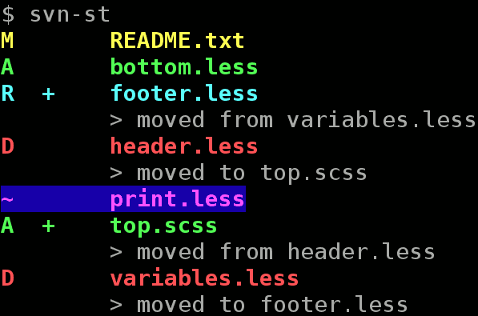
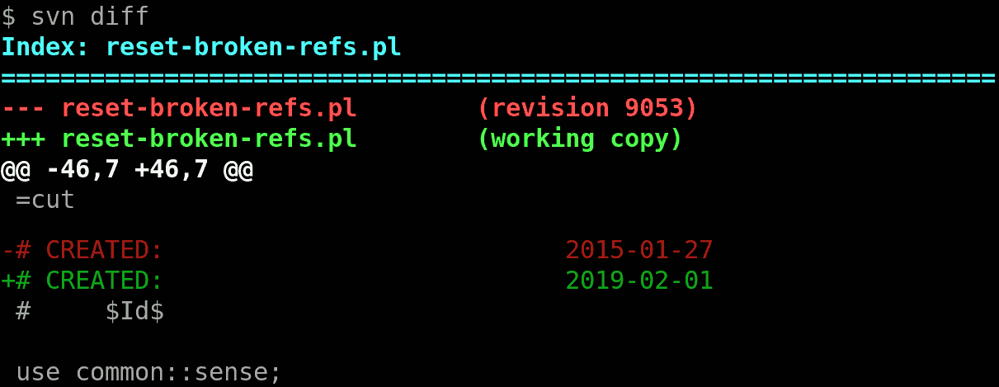

# svn-st-color

Wrapper for colorizing Subversion output.

`svn-color` is a wrapper which spawns Subversion command line client `svn`
with specified subcommand and its arguments
then tries to add ANSI colors to output.

## Installation

1. Clone repository somewhere.

2. (_optional_) Make symbolic link:

```
ln -s some/path/to/svn-color ~/bin/svn
```

or

Add alias to ~/.bash_aliases

```
# Colorful Subversion client
alias svn="some/path/to/svn-color"
```

## Usage

Use `svn-color` instead of usual `svn` or make symlink/alias (see above).





## Color schemas

There are two color schemas specified in `config.yml`:
`default` for dark background and `light`.

Preferred schema can be chosen via `SVNCOLOR` environment variable:

```bash
export SVNCOLOR=light
svn diff
```

## Frequently Asked Questions

### How to bypass this program?

You can use original `svn` client even this program is alias for it:

* Add `--bypass`, `--force-interactive` or `--no-color` argument to command line
```bash
svn subcommand --force-interactive
```

* Specify full path:
```bash
`which svn` subcommand
```

## TODO

* Make deb package.
