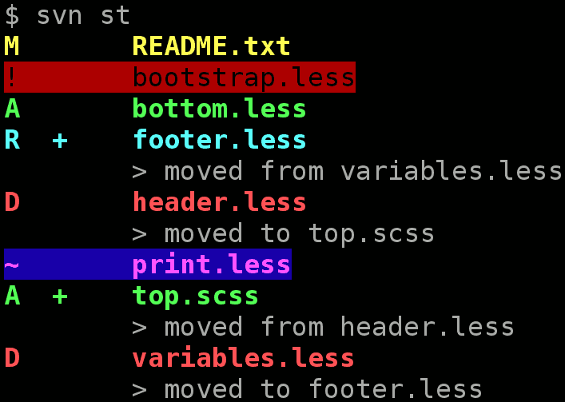

# svn-st-color

Wrappers for colorizing Subversion output

## Installation

1. Clone repository somewhere.

2. (_optional_) Make symbolic link:

```
ln -s some/path/to/svn-color ~/bin/svn
```

or

Add alias to ~/.bash_aliases

```
# Colorful Subversion client
alias svn="some/path/to/svn-color"
```

## Usage

Use `svn-color` instead of usual `svn` or make symlink/alias (see above).




